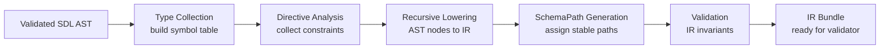

# Compiler Lowering

## Overview

Lowering is the compilation phase that transforms a validated SDL AST into the JTD-like IR. This document specifies the complete set of lowering rules, determinism guarantees, and error handling.

The lowering compiler follows the principle: **SDL is syntax; IR is semantics.** Every SDL construct maps deterministically to one or more IR nodes.

## Lowering Pipeline



### Phases

1. **Type Collection**: Build a symbol table of all defined types (scalars, enums, inputs, unions).
2. **Directive Analysis**: Extract directive arguments and validate constraints (e.g., compile regex).
3. **Recursive Lowering**: Walk the AST and emit IR nodes for each type.
4. **SchemaPath Generation**: Assign stable JSON Pointer paths to each IR node.
5. **Validation**: Verify IR invariants (no orphan refs, no cycles).
6. **Bundle Assembly**: Assemble the final `SchemaBundle`.

## Lowering Rules by SDL Construct

### Scalar Types → Scalar

SDL:
```graphql
scalar SemVer @pattern(regex: "^[0-9]+\\.[0-9]+\\.[0-9]+$")
```

IR:
```rust
Schema::Scalar(ScalarKind::Custom {
    name: "SemVer".into(),
    constraints: ScalarConstraints {
        pattern: Some("^[0-9]+\\.[0-9]+\\.[0-9]+$".into()),
        ..Default::default()
    },
})
```

**Rules**:
- Built-in scalars (`String`, `Boolean`, `Int`, `Float`) map to corresponding `ScalarKind` variants.
- Custom scalars map to `ScalarKind::Custom` with constraints from directives.
- `@pattern` directive populates `ScalarConstraints.pattern`.
- Constraints on scalar type apply to all fields using that scalar.

### Enum Types → Enum

SDL:
```graphql
enum BackoffStrategy {
  exponential
  linear
  fixed
}
```

IR:
```rust
Schema::Enum {
    values: vec![
        "exponential".into(),
        "linear".into(),
        "fixed".into(),
    ],
}
```

**Rules**:
- All enum values become strings in the `values` vector.
- Enum values must be valid GraphQL identifiers (enforced at parse time).
- No constraints on enums (JTD semantics: enum is a set of string values).

### Input Objects → Object

SDL:
```graphql
input RequestDefaults @closed {
  connection_timeout_secs: Int @default(value: "30")
  retry: RetryPolicy
  optional_field: String?
}
```

IR:
```rust
Schema::Object {
    required: IndexMap::from([
        ("retry".into(), Box::new(Schema::Ref { name: "RetryPolicy".into() })),
    ]),
    optional: IndexMap::from([
        ("connection_timeout_secs".into(), Box::new(Schema::Scalar(ScalarKind::Int {
            min: None,
            max: None,
        }))),
        ("optional_field".into(), Box::new(Schema::Scalar(ScalarKind::String {
            pattern: None,
        }))),
    ]),
    additional: AdditionalPolicy::Reject, // from @closed
}
```

**Rules**:
- **Required vs Optional Analysis**:
  - Non-null type + no default → **required**
  - Default value present → **optional** (default applied at canonicalization)
  - Nullable type (has `?`) → **optional**
  - Null type → not supported (error)
- **Directive Mapping**:
  - `@closed` → `additional: Reject`
  - `@open` → `additional: AllowAny`
  - `@mapRest` → `additional: AllowSchema(Box::new(Schema::Ref { name: "ModelDefinition".into() }))`
  - `@pattern` on field → overrides scalar pattern for that field
- **Field Type Lowering**:
  - Scalar types → `Schema::Scalar`
  - Named types → `Schema::Ref { name: TypeName }`
  - List types `[T!]!` → `Schema::Array { elements: Box::new(T_schema) }`
  - Non-null wrapper `T!` → lower `T` and ignore the wrapper (handled by required/optional logic)

### Union Types → DiscriminatedUnion or OneOf

SDL (Discriminated Union):
```graphql
input AgentWorkflow @variant(tag: "agent") { ... }
input ToolWorkflow @variant(tag: "tool") { ... }

union Workflow @discriminator(field: "kind") = AgentWorkflow | ToolWorkflow
```

IR:
```rust
Schema::DiscriminatedUnion {
    discriminator: "kind".into(),
    mapping: IndexMap::from([
        ("agent".into(), Box::new(Schema::Ref { name: "AgentWorkflow".into() })),
        ("tool".into(), Box::new(Schema::Ref { name: "ToolWorkflow".into() })),
    ]),
}
```

**Rules for @discriminator**:
- Union must have `@discriminator(field: String!)` directive.
- Each union member must have `@variant(tag: String!)` directive.
- All `@variant(tag)` values must be unique within the union.
- Mapping is built from `tag → member_schema_name`.

---

SDL (OneOf Union):
```graphql
union Step @oneOf = AgentStep | ToolStep | SubWorkflowStep
```

IR:
```rust
Schema::OneOf {
    variants: vec![
        OneOfVariant {
            label: "AgentStep".into(),
            schema: Box::new(Schema::Ref { name: "AgentStep".into() }),
        },
        OneOfVariant {
            label: "ToolStep".into(),
            schema: Box::new(Schema::Ref { name: "ToolStep".into() }),
        },
        OneOfVariant {
            label: "SubWorkflowStep".into(),
            schema: Box::new(Schema::Ref { name: "SubWorkflowStep".into() }),
        },
    ],
}
```

**Rules for @oneOf**:
- Union must have `@oneOf` directive.
- No `@discriminator` or `@variant` allowed when using `@oneOf`.
- Order of variants preserves SDL declaration order (for deterministic errors).

### @mapRest → AllowSchema

SDL:
```graphql
input ModelDefinition @closed { ... }

input ModelsSection @closed @mapRest(value: ModelDefinition) {
  global_config_path: String
  default_router: String
}
```

IR:
```rust
Schema::Object {
    required: IndexMap::new(),
    optional: IndexMap::from([
        ("global_config_path".into(), Box::new(Schema::Scalar(ScalarKind::String { pattern: None })),
        ("default_router".into(), Box::new(Schema::Scalar(ScalarKind::String { pattern: None })),
    ]),
    additional: AdditionalPolicy::AllowSchema(Box::new(Schema::Ref {
        name: "ModelDefinition".into(),
    })),
}
```

**Rules**:
- `@mapRest(value: TypeName!)` argument must resolve to a defined type.
- All unknown keys validate against the referenced schema.
- Known keys (required/optional) are unaffected.
- This is the KEY extension beyond JTD (JTD only supports boolean `additionalProperties`).

### @default → Optional Field with Default Metadata

SDL:
```graphql
input RetryPolicy @closed {
  max_attempts: Int @default(value: "3")
  initial_delay_secs: Int @default(value: "1")
}
```

IR:
```rust
Schema::Object {
    required: IndexMap::new(),
    optional: IndexMap::from([
        ("max_attempts".into(), Box::new(Schema::Scalar(ScalarKind::Int {
            min: None,
            max: None,
        }))),
        ("initial_delay_secs".into(), Box::new(Schema::Scalar(ScalarKind::Int {
            min: None,
            max: None,
        } })),
    ]),
    // ... (default values stored separately or as metadata)
}
```

**Rules**:
- Field moves from `required` to `optional`.
- Default value is parsed and validated against the field's type during lowering.
- Default values are applied during document canonicalization (before validation).
- Invalid default values cause lowering errors.

### @pattern → Scalar Constraint

SDL:
```graphql
scalar SemVer @pattern(regex: "^[0-9]+\\.[0-9]+\\.[0-9]+$")

input Workflow {
  version: SemVer
}
```

IR:
```rust
// SemVer scalar definition
Schema::Scalar(ScalarKind::Custom {
    name: "SemVer".into(),
    constraints: ScalarConstraints {
        pattern: Some("^[0-9]+\\.[0-9]+\\.[0-9]+$".into()),
        ..Default::default()
    },
})

// Workflow.version field
Schema::Scalar(ScalarKind::Custom {
    name: "SemVer".into(),
    constraints: ScalarConstraints {
        pattern: Some("^[0-9]+\\.[0-9]+\\.[0-9]+$".into()),
        ..Default::default()
    },
})
```

**Rules**:
- `@pattern(regex: String!)` directive value is compiled as a regex during lowering.
- Invalid regex (syntax error) causes lowering error.
- Pattern on scalar type applies to all fields using that scalar.
- Pattern on field overrides scalar pattern.

### @oneOf on Input Object → OneOf Wrapper

SDL:
```graphql
input RetryPolicy @oneOf {
  exponential: ExponentialBackoff
  linear: LinearBackoff
  fixed: FixedBackoff
}
```

IR:
```rust
Schema::OneOf {
    variants: vec![
        OneOfVariant {
            label: "exponential".into(),
            schema: Box::new(Schema::Object {
                required: IndexMap::from([
                    ("exponential".into(), Box::new(Schema::Ref { name: "ExponentialBackoff".into() })),
                ]),
                optional: IndexMap::new(),
                additional: AdditionalPolicy::Reject,
            }),
        },
        OneOfVariant {
            label: "linear".into(),
            schema: Box::new(Schema::Object {
                required: IndexMap::from([
                    ("linear".into(), Box::new(Schema::Ref { name: "LinearBackoff".into() })),
                ]),
                optional: IndexMap::new(),
                additional: AdditionalPolicy::Reject,
            }),
        },
        OneOfVariant {
            label: "fixed".into(),
            schema: Box::new(Schema::Object {
                required: IndexMap::from([
                    ("fixed".into(), Box::new(Schema::Ref { name: "FixedBackoff".into() })),
                ]),
                optional: IndexMap::new(),
                additional: AdditionalPolicy::Reject,
            }),
        },
    ],
}
```

**Rules**:
- Each field becomes a `OneOfVariant` with a label matching the field name.
- Variant schema is an `Object` with that single field as required.
- Exactly one variant must match during validation.
- Required fields in `@oneOf` input cause warnings (makes validation impossible).

## Name Resolution

All type references must resolve to defined types in the same schema bundle.

### Resolution Rules

1. During **Type Collection** phase, build a symbol table:
   ```rust
   struct SymbolTable {
       scalars: HashSet<String>,
       enums: HashSet<String>,
       inputs: HashSet<String>,
       unions: HashSet<String>,
   }
   ```

2. During **Lowering**, verify:
   - Field type references exist in symbol table.
   - Union members exist in symbol table.
   - `@mapRest(value: TypeName!)` reference exists.
   - `@ref(name: String!)` reference exists.

3. Unresolved references cause lowering errors:
   ```
   error: Type 'UndefinedType' is not defined in this schema
     --> schema.graphql:15:25
      |
    15 |   field: UndefinedType!
       |                  ^^^^^^^^^^^^^^^^ type not found
   ```

## Recursive Type Detection

Recursive type definitions must use `@ref` to avoid infinite loops.

## Gap Fix: Recursive Cycle Detection

Detecting recursive type cycles requires DFS with coloring to distinguish between self-recursion, mutual recursion, and true cycles.

### Algorithm: DFS with Coloring

```rust
#[derive(Debug, Clone, Copy, PartialEq, Eq)]
enum NodeColor {
    White,  // Unvisited
    Gray,   // In progress (on recursion stack)
    Black,  // Done (fully processed)
}

struct CycleDetector {
    colors: std::collections::HashMap<String, NodeColor>,
    path: Vec<String>,
}

impl CycleDetector {
    fn new() -> Self {
        Self {
            colors: std::collections::HashMap::new(),
            path: Vec::new(),
        }
    }

    fn detect_cycle(
        &mut self,
        type_name: &str,
        bundle: &SchemaBundle,
    ) -> Result<(), Vec<String>> {
        match self.colors.get(type_name) {
            Some(NodeColor::Gray) => {
                // Cycle detected! Return the cycle path
                let cycle_start = self.path.iter().position(|n| n == type_name).unwrap();
                let cycle = self.path[cycle_start..].to_vec();
                Err(cycle)
            }
            Some(NodeColor::Black) => {
                // Already processed, safe to emit Ref
                Ok(())
            }
            Some(NodeColor::White) | None => {
                // First visit
                self.colors.insert(type_name.to_string(), NodeColor::Gray);
                self.path.push(type_name.to_string());

                // Recurse into type to find refs
                if let Some(schema) = bundle.get(type_name) {
                    self.collect_refs_from_schema(schema, bundle)?;
                }

                // Mark as done
                self.colors.insert(type_name.to_string(), NodeColor::Black);
                self.path.pop();
                Ok(())
            }
        }
    }

    fn collect_refs_from_schema(
        &mut self,
        schema: &Schema,
        bundle: &SchemaBundle,
    ) -> Result<(), Vec<String>> {
        match schema {
            Schema::Object { required, optional, additional } => {
                // Collect refs from required and optional fields
                for field_schema in required.values().chain(optional.values()) {
                    self.collect_refs_from_schema(field_schema, bundle)?;
                }
                // Check additional schema
                if let AdditionalPolicy::AllowSchema(ref_schema) = additional {
                    self.collect_refs_from_schema(ref_schema, bundle)?;
                }
            }
            Schema::Array { elements } => {
                self.collect_refs_from_schema(elements, bundle)?;
            }
            Schema::Map { values } => {
                self.collect_refs_from_schema(values, bundle)?;
            }
            Schema::OneOf { variants } => {
                for variant in variants {
                    self.collect_refs_from_schema(&variant.schema, bundle)?;
                }
            }
            Schema::DiscriminatedUnion { mapping, .. } => {
                for member_schema in mapping.values() {
                    self.collect_refs_from_schema(member_schema, bundle)?;
                }
            }
            Schema::Ref { name } => {
                // Detect cycle when following ref
                self.detect_cycle(name, bundle)?;
            }
            _ => {} // Scalar, Enum, Any - no refs
        }
        Ok(())
    }
}
```

### Self-Recursion (Allowed)

```graphql
input Node {
  name: String!
  children: [Node!]!  # Self-reference
}
```

IR becomes:
```rust
Schema::Object {
    required: IndexMap::from([
        ("children".into(), Box::new(Schema::Array {
            elements: Box::new(Schema::Ref { name: "Node".into() })
        }))
    ]),
    // ...
}
```

**Result**: Valid self-recursion. Ref allows validation-time guard.

### Mutual Recursion (Allowed)

```graphql
input A {
  b: B!
}
input B {
  a: A!
}
```

IR becomes:
```rust
Schema::Object {
    required: IndexMap::from([
        ("b".into(), Box::new(Schema::Ref { name: "B".into() }))
    ]),
}
// ... and B references A
```

**Result**: Valid mutual recursion. Both become Ref pairs.

### Validation-Time Guard

Prevent infinite recursion during validation with max depth counter:

```rust
pub struct ValidationContext {
    max_depth: usize,
    current_depth: usize,
    // ... other fields
}

impl ValidationContext {
    fn with_depth<F, R>(&mut self, f: F) -> R
    where
        F: FnOnce(&mut Self) -> R,
    {
        self.current_depth += 1;
        if self.current_depth > self.max_depth {
            self.errors.push(ValidationError {
                code: ErrorCode::RecursiveType,
                instance_path: self.instance_path.clone(),
                schema_path: self.schema_path.clone(),
                message: format!("Recursion depth {} exceeds max {}", self.current_depth, self.max_depth),
                hint: Some("Simplify recursive structure or increase max depth".into()),
            });
            self.current_depth -= 1;
            return f(self);
        }

        let result = f(self);
        self.current_depth -= 1;
        result
    }
}
```

**Default max depth**: 64 (configurable).

### Unresolvable Cycle (Error)

If `Ref` references non-existent type:

```rust
Schema::Ref { name: "NonExistentType".into() }
```

**Error during validation**:
```rust
ErrorCode::RefUnresolved {
    message: "Unresolved schema reference: NonExistentType",
    hint: Some("Referenced schema does not exist".into()),
}
```

### Detection Algorithm

Use depth-first search (DFS) with path tracking:

```rust
fn detect_cycles(
    schema: &Schema,
    bundle: &SchemaBundle,
    path: &Vec<String>,
    cycles: &mut Vec<String>,
) {
    match schema {
        Schema::Ref { name } => {
            if path.contains(name) {
                cycles.push(format!("Cycle detected: {}", path.join(" -> ")));
                return;
            }
            if let Some(target) = bundle.resolve(name) {
                let mut new_path = path.clone();
                new_path.push(name.clone());
                detect_cycles(target, bundle, &new_path, cycles);
            }
        }
        Schema::Object { required, optional, additional } => {
            for schema in required.values().chain(optional.values()) {
                detect_cycles(schema, bundle, path, cycles);
            }
            if let AdditionalPolicy::AllowSchema(schema) = additional {
                detect_cycles(schema, bundle, path, cycles);
            }
        }
        Schema::Array { elements } => {
            detect_cycles(elements, bundle, path, cycles);
        }
        Schema::Map { values } => {
            detect_cycles(values, bundle, path, cycles);
        }
        Schema::OneOf { variants } => {
            for variant in variants {
                detect_cycles(&variant.schema, bundle, path, cycles);
            }
        }
        Schema::DiscriminatedUnion { mapping, .. } => {
            for schema in mapping.values() {
                detect_cycles(schema, bundle, path, cycles);
            }
        }
        _ => {} // Scalar, Enum, Any - no recursion
    }
}
```

### Error on Direct Recursion

SDL:
```graphql
input Node {
  next: Node  # ERROR: direct recursion without @ref
}
```

Error:
```
error: Direct recursion without @ref is not allowed
  --> schema.graphql:2:3
   |
 2 |   next: Node
    |   ^^^^^^^^^ 'Node' references itself directly

Use @ref to create recursive references: next: Node @ref(name: "Node")
```

### Correct Recursive Definition

SDL:
```graphql
input Node {
  next: Node @ref(name: "Node")
}
```

IR:
```rust
Schema::Object {
    required: IndexMap::from([
        ("next".into(), Box::new(Schema::Ref { name: "Node".into() })),
    ]),
    optional: IndexMap::new(),
    additional: AdditionalPolicy::Reject,
}
```

## Directive Validation

All directives must be validated during lowering.

### Validation Rules

1. **Unknown Directives**:
   - Error if directive not in allowed set: `[@closed, @open, @pattern, @default, @oneOf, @discriminator, @variant, @mapRest, @ref]`

2. **Wrong Arguments**:
   - Error if directive argument name wrong or type mismatch.
   - Example: `@pattern` requires `regex: String!`, not `foo: String!`

3. **Wrong Attachment Points**:
   - `@closed`, `@open`, `@mapRest` → only `INPUT_OBJECT`
   - `@discriminator`, `@variant`, `@oneOf` (union form) → only `UNION`
   - `@oneOf` (input form) → only `INPUT_OBJECT`
   - `@pattern` → `SCALAR` or `INPUT_FIELD_DEFINITION`
   - `@default` → `INPUT_FIELD_DEFINITION`
   - `@ref` → `INPUT_FIELD_DEFINITION` or `INPUT_OBJECT`

4. **Argument Validation**:
   - `@pattern(regex: String!)`: Compile regex; error if invalid.
   - `@discriminator(field: String!)`: Field name must be valid identifier.
   - `@mapRest(value: TypeName!)`: Type must exist and not be `Any`.

## Determinism

The same SDL source must always produce the same IR and the same `SchemaPath` values.

### Determinism Guarantees

1. **SchemaPath Stability**: Same SDL → identical JSON Pointer paths.
2. **Variant Order**: `OneOf` variants preserve SDL declaration order.
3. **Field Order**: `required` and `optional` maps use `IndexMap` (preserves insertion order).
4. **Cycle Detection**: DFS order is deterministic (traversal order is stable).

### Testing Determinism

Write snapshot tests that capture:
- IR structure (via `Debug` or custom serialization)
- All `SchemaPath` values
- All directive arguments

Example snapshot test:
```rust
#[test]
fn deterministic_lowering() {
    let sdl = r#"
        input Foo @closed {
            a: String!
            b: Int
        }
    "#;

    let bundle = compile_sdl(sdl).unwrap();
    let ir = &bundle.schemas["Foo"];

    insta::assert_debug_snapshot!(ir);
}
```

## SchemaPath Generation

Every IR node gets a stable `SchemaPath` assigned during lowering.

### Generation Algorithm

```rust
fn assign_schema_paths(
    bundle: &mut SchemaBundle,
    root_name: &str,
) {
    let mut path = JsonPointer::root();

    fn visit(schema: &Schema, path: &mut JsonPointer, paths: &mut Vec<(String, JsonPointer)>) {
        paths.push((schema_path_for_diagnostic(schema), path.clone()));

        match schema {
            Schema::Object { required, optional, additional } => {
                for (key, sub_schema) in required.iter() {
                    path.push_key(key);
                    visit(sub_schema, path, paths);
                    path.pop();
                }
                for (key, sub_schema) in optional.iter() {
                    path.push_key(key);
                    visit(sub_schema, path, paths);
                    path.pop();
                }
                if let AdditionalPolicy::AllowSchema(sub_schema) = additional {
                    path.push_key("additionalProperties");
                    visit(sub_schema, path, paths);
                    path.pop();
                }
            }
            Schema::Array { elements } => {
                path.push_key("elements");
                visit(elements, path, paths);
                path.pop();
            }
            Schema::Map { values } => {
                path.push_key("values");
                visit(values, path, paths);
                path.pop();
            }
            Schema::OneOf { variants } => {
                for (i, variant) in variants.iter().enumerate() {
                    path.push_key(&format!("oneOf/{}", i));
                    visit(&variant.schema, path, paths);
                    path.pop();
                }
            }
            Schema::DiscriminatedUnion { mapping, .. } => {
                for (tag, sub_schema) in mapping.iter() {
                    path.push_key(&format!("mapping/{}", tag));
                    visit(sub_schema, path, paths);
                    path.pop();
                }
            }
            Schema::Ref { name } => {
                // Do not follow refs (avoid infinite loops)
            }
            _ => {} // Scalar, Enum, Any - no children
        }
    }

    let root_schema = bundle.schemas.get(root_name).unwrap();
    let mut paths = Vec::new();
    visit(root_schema, &mut path, &mut paths);

    // Store paths in bundle for error reporting
    bundle.schema_paths = paths;
}
```

### SchemaPath Assignment Rules

See [01-ir-design.md](./01-ir-design.md) "SchemaPath Generation Strategy" for complete rules.

## Error Handling During Lowering

Lowering can fail with the following error categories:

1. **Resolution Errors**: Type references that don't exist.
2. **Directive Errors**: Unknown directives, wrong arguments, wrong attachment points.
3. **Constraint Errors**: Invalid regex, invalid default value.
4. **Recursion Errors**: Direct recursion without `@ref`.
5. **Cycle Errors**: Detected recursive type cycles.

### Error Format

```rust
#[derive(Debug, Clone, PartialEq, Eq)]
pub enum LoweringError {
    TypeNotFound {
        type_name: String,
        location: Location,
    },
    DirectiveUnknown {
        directive_name: String,
        location: Location,
    },
    DirectiveInvalidAttachment {
        directive_name: String,
        expected: Vec<String>,
        found: String,
        location: Location,
    },
    RegexInvalid {
        pattern: String,
        message: String,
        location: Location,
    },
    DefaultValueInvalid {
        field_name: String,
        value: String,
        reason: String,
        location: Location,
    },
    DirectRecursion {
        type_name: String,
        location: Location,
    },
    CycleDetected {
        path: Vec<String>,
    },
}

#[derive(Debug, Clone, PartialEq, Eq)]
pub struct Location {
    pub file: String,
    pub line: usize,
    pub column: usize,
}
```

## Cross-Reference Links

- **[01-ir-design.md](./01-ir-design.md)**: IR type definitions that SDL constructs lower to
- **[02-sdl-grammar.md](./02-sdl-grammar.md)**: SDL grammar and directive specifications (source for lowering)
- **[04-validator-runtime.md](./04-validator-runtime.md)**: How validator consumes the IR produced by lowering
- **[05-error-reporting.md](./05-error-reporting.md)**: Lowering error formatting and UX

## Open Questions and Decisions Needed

1. **Lowering order**: Should we lower types in symbol table order or dependency order? (recommended: dependency order for better error messages)
2. **Directive argument parsing**: Should we support string literals as values for all directive arguments, or only strings? (recommendation: all arguments are strings, parse during lowering)
3. **Default value coercion**: Should default values be coerced to the field's type (e.g., `"123"` → `123` for Int)? (recommended: no strict coercion, require exact match)
4. **Variant label for OneOf**: Should we use field name or type name as the `OneOfVariant.label`? (recommended: field name for better diagnostics)
5. **SchemaPath for scalar constraints**: Should constraints get their own schema path segments (e.g., `/pattern`)? (recommended: yes, for precise error reporting)
6. **Ref name scoping**: Should `@ref(name: "...")` support JSON Pointer paths like `#/definitions/TypeName`? (recommendation: start with simple names only, add JSON Pointer support later)

## Research Links

### SDL to IR Mapping
- See "Compiler architecture and JTD-like IR" section in second research report for lowering pipeline diagram.
- See "Lowering rules from SDL to IR" section for complete mapping rules.

### @mapRest Extension
- See "Map types and @mapRest" section in second research report for the key extension semantics.
- See example `ModelsSection` in "Example-driven SDL" section for SDL modeling.

### Recursive Types
- See "Recursive type detection" section in second research report for cycle detection algorithm.
- See "Error messages for invalid SDL usage" in 02-sdl-grammar.md for example error formats.

### Determinism and SchemaPath
- See "SchemaPath generation strategy" in 01-ir-design.md for path assignment rules.
- See "Determinism" section in 01-ir-design.md for guarantees.
