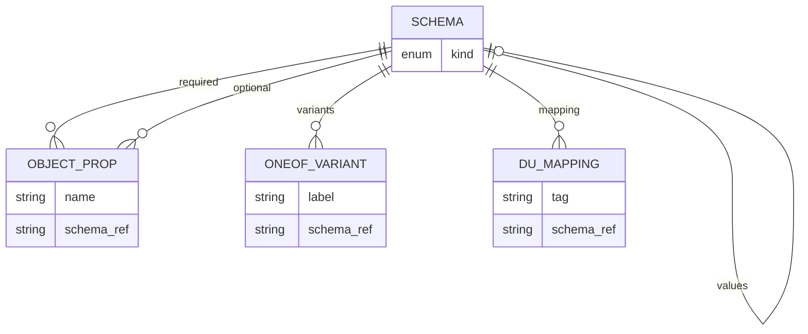
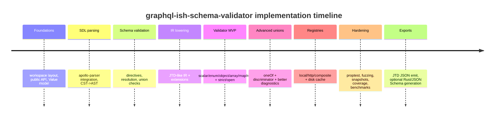

# Deep Research Report on Building `graphql-ish-schema-validator`

## Executive summary

You can build **`graphql-ish-schema-validator`** as a Rust-first schema system for YAML/JSON by treating **GraphQL SDL as the authoring layer**, compiling (“lowering”) it into a **JTD-like internal IR**, then validating parsed YAML/JSON values against that IR with kubeconform-like strictness and excellent diagnostics. The key is to separate two validations:

- **Schema validation**: parsing and verifying your custom SDL is internally consistent (names resolve, directives are well-formed, unions are coherent, defaults are type-compatible, etc.). The GraphQL spec provides the syntactic scaffolding (e.g., scalars, enums, input objects, type references, descriptions, directives). citeturn0search20turn8view1turn17search18  
- **Instance validation**: applying the compiled IR to YAML/JSON content and emitting actionable errors with stable machine-readable pointers (JTD-style `instancePath`/`schemaPath`). citeturn0search1turn13view0turn11view0  

This approach matches your stated preferences: “GraphQL schema feel” for authors, but **JTD-like, explicitly-typed, compiler-friendly IR** for a Rust validator and for optional export into literal JTD JSON where possible. JTD’s stated goals—portable validation with standardized error indicators and code generation friendliness—align directly with your requirements. citeturn0search1turn9view0turn9view1  

For implementation, lean on:

- `apollo-parser` for SDL parsing (error-resilient CST + errors) and your own semantic validation passes. citeturn0search0turn0search16turn0search8  
- A carefully-designed IR that resembles JTD’s mutually-exclusive forms, plus a minimal set of “pragmatic extensions” you need (notably: `OneOf`, and object “map-of-rest” support). JTD’s forms and semantics are clearly enumerated in RFC 8927. citeturn10view0turn10view1turn12view2  
- kubeconform-inspired runtime modes and registry behavior: strict additional-properties and duplicate-key handling, multiple schema locations, and caching of downloaded schemas. citeturn3view1turn3view2turn3view0  

The rest of this report details an implementable spec, IR, validator algorithms, registry layout, and a repository plan you can “one-shot” into a new repo via the `gh` CLI.

## Problem framing and reference points

### Why GraphQL SDL works as a schema authoring UX

GraphQL SDL gives you:

- A compact type language (named types, lists, non-null wrappers, enums, scalars). citeturn0search20turn8view1turn17search18  
- Built-in “docstring” descriptions, which become first-class documentation in tooling. citeturn8view1turn0search20  
- A directive system you can repurpose as “schema annotations” (constraints, defaults, closure, discriminators), which is exactly how you want to express modern schema features. citeturn7view1turn8view1  

Separately, the GraphQL ecosystem has been evolving on the exact “polymorphic inputs” problem: the `@oneOf` directive for one-of input objects is documented and discussed publicly. citeturn17search3turn17search15turn17search22  
Even if you extend beyond official semantics, *adopting familiar names* reduces cognitive load.

### Why JTD is a good “compiler target” IR

JTD (RFC 8927) positions itself as:

- A schema language intended to be no more expressive than mainstream programming language type systems (helpful for Rust). citeturn0search1turn9view0turn9view1  
- A system with **portable, standardized error indicators** primarily via JSON pointers. citeturn13view0turn11view0turn16search3  
- A set of **eight mutually-exclusive schema forms** (Empty, Ref, Type, Enum, Elements, Properties, Values, Discriminator), which maps cleanly to a Rust `enum`. citeturn10view0turn10view1  

You do **not** need to love JSON Schema to benefit from this: JTD is intentionally smaller and more “type-shaped.” citeturn0search1turn9view1  

Important nuance: RFC 8927 is **Experimental** and was published on the Independent Submission stream (not IETF consensus), which matters if you must claim “industry standard” formally. citeturn0search9turn9view0  

### kubeconform as the behavioral north star for strictness + registries

kubeconform is a manifest validation tool that emphasizes performance, multi-source schema resolution, and caching. citeturn2view0turn3view1turn3view2  
Three behaviors are directly transferable:

- `-strict` disallows additional properties and duplicated keys. citeturn3view0  
- Multiple `-schema-location` entries are tried in order; templating is supported for schema naming conventions. citeturn3view1turn3view3  
- `-cache` enables caching schemas downloaded over HTTP. citeturn3view2  

This design strongly matches your need for “schema registries (local/remote), caching, and strict mode like kubeconform.”

## Custom SDL mini-spec for `graphql-ish-schema-validator`

This section defines the **subset of GraphQL SDL** you support and the **custom directives** that turn SDL into a YAML/JSON validation schema language.

### Supported SDL constructs

You can parse full GraphQL SDL syntax, but only accept these definitions semantically:

- `scalar` definitions  
- `enum` definitions  
- `input` object definitions (your primary “record/object” form)  
- `union` definitions (repurposed for input/validation unions)  
- Descriptions (GraphQL uses `StringValue`-based descriptions in the type system grammar). citeturn8view1turn0search20  
- Directives in “const” positions on types/fields (GraphQL grammar supports directives on type definitions). citeturn8view1turn0search20  

Parsing recommendation: `apollo-parser` is explicitly built to parse schemas and queries according to the October 2021 spec, and is designed to be error-resilient (always returns a CST plus errors). citeturn0search0turn0search16turn0search4  

### Directive set and semantics

A practical directive set that matches your earlier requirements and maps cleanly into a JTD-like IR:

- `@closed`  
  Declares an object type closed to unknown keys (unless paired with `@mapRest`). Mirrors JTD’s default “no additional properties unless enabled.” citeturn12view2turn12view0  

- `@open` (recommended addition)  
  Explicitly allow unknown keys (but only in non-strict runtime mode). This makes author intent explicit; strict runtime can still override.

- `@pattern(regex: String!)`  
  Attachable to `scalar` definitions or specific fields where the effective type is string-like.

- `@default(value: String!)` (or GraphQL default literal syntax)  
  You can support both, but pick one “canonical” representation for simplicity. GraphQL input coercion rules already define default application behavior. citeturn8view0turn17search18  

- `@oneOf`  
  Two contexts:
  - On `input` types: GraphQL-style “exactly one field must be set” semantics (aligned with GraphQL’s own direction; at minimum, align with public documentation of how `@oneOf` is intended). citeturn17search3turn17search22turn17search15  
  - On `union` types: your validator’s “exactly one variant schema matches” semantics (shape-based union; more below).

- `@discriminator(field: String!)` on `union` types  
  Builds a discriminated union schema; maps to JTD’s Discriminator form. citeturn10view1turn10view2turn13view0  

- `@variant(tag: String!)` on union member type definitions  
  Associates a tag value with a variant when compiling a discriminated union, similar in spirit to JTD’s `mapping`. citeturn10view0turn13view0  

- `@mapRest(value: TypeName!)` on `input` object definitions  
  Your crucial extension: validates “unknown keys” (the “rest”) as a map of values of a particular schema. This is the feature that lets you model patterns like your `models:` section where fixed keys coexist with arbitrary model entries.

- `@ref(name: String!)` (optional)  
  If you want explicit schema references beyond SDL type names (e.g., registry lookups, or JSON Pointer references). Many uses are covered by SDL types + `union`, so treat `@ref` as an advanced feature.

### Example-driven SDL using your workflow YAML

Your workflow YAML includes explicit notes that **step type is inferred by which keys are present** (e.g., `generative_entity + prompt` → LLM step; `tool` → tool step; only `when` → control step; etc.). This is exactly where a **shape-based `union Step`** is valuable. (From your YAML: see the “step type is INFERRED…” comment block around lines ~0275–0280 in `/mnt/data/unified-workflow-schema.yml`.)

Below is a **representative** SDL slice that models this, plus the “fixed keys + rest map” pattern used in `models:`. The full schema would expand these types to cover all fields in the YAML; the patterns here are what drive the implementation.

```graphql
"""
Root document matching unified-workflow-schema.yml.
"""
input WorkflowDocument @closed {
  workflow_id: String!
  name: String!
  description: String!

  version: SemVer!
  author: String!
  tags: [String!]!

  providers: Providers!

  """
  models has fixed keys plus arbitrary model entries.
  Implement with @mapRest.
  """
  models: ModelsSection! # @mapRest handled at type level

  sub_workflows: SubWorkflows!

  agentic_workflow: AgenticWorkflow!
  workflow_execution_strategy: ExecutionStrategy!
  tool_permissions: ToolPermissions!
  memory: MemoryConfig!
  workspace: WorkspaceConfig!

  schema_version: SemVer!
  min_schema_version: SemVer!
}

scalar SemVer @pattern(regex: "^[0-9]+\\.[0-9]+\\.[0-9]+$")
scalar Percent @pattern(regex: "^[0-9]+%$")
scalar HumanSize @pattern(regex: "^[0-9]+(\\.[0-9]+)?(KB|MB|GB|TB)$")
scalar Duration @pattern(regex: "^[0-9]+(ms|s|m|h|d)$")
scalar TemplateRef @pattern(regex: "^\\$\\{[^}]+\\}$")

enum BackoffStrategy {
  exponential
  linear
  fixed
}

input Providers @closed {
  lmstudio: LmstudioProvider
  ollama: FileRefProvider
  llama_cpp_with_vulkan: FileRefProvider
}

input FileRefProvider @closed {
  config_file: String!
}

input LmstudioProvider @closed {
  config: LmstudioConfig
}

input LmstudioConfig @closed {
  host: String
  requests: RequestDefaults
}

input RequestDefaults @closed {
  connection_timeout_secs: Int
  retry: RetryPolicy
}

input RetryPolicy @closed {
  max_attempts: Int
  initial_delay_secs: Int
  backoff: BackoffStrategy
}

"""
Fixed keys plus arbitrary model entries:
everything not explicitly listed must validate as ModelDefinition.
"""
input ModelsSection @closed @mapRest(value: ModelDefinition) {
  global_config_path: String
  default_router: String
}

input ModelDefinition @closed {
  name: String!
  provider: String!

  cache_policy: String
  ram_allocation: Percent
  vram_allocation: HumanSize

  # Reference to another model by template string
  parent_model: TemplateRef
}

input SubWorkflows @closed {
  analyze_workflow: String! # path string
  validate_workflow: InlineWorkflow
  fix_workflow: ExternalWorkflowWithDefaults
}

input InlineWorkflow @closed {
  inputs: [InputDef!]!
  steps: StepMap!
}

input ExternalWorkflowWithDefaults @closed {
  path: String!
  default_inputs: [InputDef!]
}

input InputDef @closed {
  name: String!
  type: String!
  required: Boolean
  default: String
}

"""
A map keyed by step name. Implement as a map/dictionary in IR.
"""
input StepMap @closed @mapRest(value: Step) {
}

"""
Step is a shape-based union. Exactly one variant should match.
"""
union Step @oneOf = AgentStep | ToolStep | SubWorkflowStep | LoopStep | ControlFlowStep

input AgentStep @closed {
  generative_entity: String!
  prompt: String!
  model_overrides: ModelOverrides
  user_input: UserInput
  retry: RetryPolicy
  depends_on: [String!]
  when: StepWhen
  requires: [Requirement!]
  parallel_group: String
}

input ToolStep @closed {
  tool: String!
  input: Any
  depends_on: [String!]
  when: StepWhen
}

input SubWorkflowStep @closed {
  sub_workflow: String!
  input: Any
  when: StepWhen
}

input LoopStep @closed {
  loop: LoopSpec!
  sub_workflow: String!
  input: Any
  when: StepWhen
}

input ControlFlowStep @closed {
  when: StepWhen!
  requires: [Requirement!]
  on_requires_failed: ControlAction
}

input ModelOverrides @closed {
  model: TemplateRef
  temperature: Float
  top_p: Float
}

input UserInput @closed {
  prompt_user: String!
  input_type: String
  required: Boolean
}

input StepWhen @closed {
  after_step_fails: String
  after_step_succeeds: String
  always: Boolean
}

input Requirement @closed {
  # Example union: ref string or inline criteria object
  ref: String
  exact_criteria: Criteria
}

input Criteria @closed {
  operator: String @pattern(regex: "^(==|!=|>=|<=|>|<)$")
  value: String
}

enum ControlAction {
  abort
  skip
  continue
}

input LoopSpec @closed {
  collection_var: String
  item_var: String
  max_iterations: Int
}

scalar Any
```

This SDL is intentionally **GraphQL-like**, but it is **not “a GraphQL server schema”**—it is a schema for YAML/JSON documents. The parser accepts the syntax, and your compiler defines the meaning.

## Compiler architecture and JTD-like IR

### JTD-like IR definition

Your IR should be a compact Rust `enum` whose variants map to JTD’s model of “schema forms,” extended only where necessary.

JTD itself defines eight mutually-exclusive forms. citeturn10view0turn10view1  
For your stated requirements, an IR shaped like this will work:

- `Scalar`
- `Enum`
- `Array`
- `Object { required, optional, additional }`
- `Map`
- `DiscriminatedUnion`
- `OneOf`
- `Ref`
- `Any`

Why this is coherent:

- The “type” and “enum” forms in JTD map cleanly to Scalar/Enum. citeturn10view0turn11view0  
- `elements` maps cleanly to `Array`. citeturn10view0turn11view0  
- `properties` maps to `Object` with required/optional and additional properties behavior. citeturn10view1turn12view2  
- `values` maps to `Map`. citeturn10view1turn12view2  
- `discriminator` maps to DiscriminatedUnion. citeturn10view1turn13view0  
- `ref` maps to `Ref`. citeturn10view0turn0search1  

Two pragmatic notes:

- JTD’s `additionalProperties` is a boolean and applies only in the “properties” form, and it does not inherit into subschemas. citeturn12view0turn12view2  
- Your `@mapRest` feature is effectively “additionalProperties with a schema,” which is **not literal JTD**—so you must treat it as an **IR extension** and only export to JTD when the schema segment is representable. (This is how you achieve the “optionally emit literal JTD JSON” requirement without compromising correctness.)

### Mermaid diagram of the end-to-end compiler/validator flow

```mermaid
flowchart LR
  A[SDL source\n*.graphql-ish] --> B[Parse\napollo-parser CST + errors]
  B --> C[Build AST\n(custom, subset)]
  C --> D[Schema semantic validation\n(names, directives, unions)]
  D --> E[Lowering\nAST -> JTD-like IR]
  E --> F[Optional export\nIR -> JTD JSON]
  E --> G[Validator runtime\nIR + canonical value]
  H[Input YAML/JSON] --> I[Parse\nserde_json + YAML parser]
  I --> J[Canonicalize\nValue model + defaults]
  J --> G
  G --> K[ValidationReport\nerrors + pointers + hints]
```

`apollo-parser` is designed specifically for parsing GraphQL schemas/queries and provides errors alongside a tree representation. citeturn0search0turn0search16turn0search8  

### Mermaid diagram of the IR entity relationships



### Lowering rules from SDL to IR

A robust lowering algorithm should follow the idea that **SDL is syntax; IR is semantics**.

Core rules:

- **Scalar types**
  - Built-in scalars: `String`, `Boolean`, `Int`, `Float` map to Scalar kinds.
  - Custom scalars map to `Scalar(kind=String)` plus constraints (`@pattern`, format, etc.).
  - If you include a `timestamp` scalar, you can align with JTD’s built-in `timestamp` type. citeturn10view1turn11view0  

- **Enums**
  - GraphQL enums become `Enum(values=[...])`.
  - If you need to validate string values like `>=` that cannot be enum values, you must model them as string + pattern (as shown above). This aligns with how JTD constrains enums to strings. citeturn10view0turn11view0  

- **Input objects**
  - Each field becomes either required or optional depending on:
    - Non-null + no default means required.
    - Default means optional (default will be applied).
    - Nullable means optional.
  - This is consistent with GraphQL input coercion rules: missing required non-null fields without defaults is an error; defaults should be applied for missing fields when provided. citeturn8view0turn17search18  

- **`@closed` and unknown keys**
  - Treat `@closed` as “reject additional properties” in both strict and non-strict modes.
  - Treat “default open-ness” as a runtime policy controlled by validation mode (see the validator section).

- **Map types and `@mapRest`**
  - If an input object has `@mapRest(value: T)`, compile it as:
    - known properties (required/optional) plus
    - `additional_schema = schema(T)` and `additional_policy = AllowSchema`
  - This is your “fixed keys + rest” escape hatch; it models the `models:` section structure cleanly.

- **Unions**
  - If `union X @discriminator(field: "...") = A | B | C`, compile to `DiscriminatedUnion`.
  - Otherwise, if `union X @oneOf = A | B | C`, compile to `OneOf([A,B,C])` with “exactly one matches” semantics.

### Parser options table

| Option | What you get | Why it fits | Why it may not |
|---|---|---|---|
| `apollo-parser` | Error-resilient parsing; always returns a CST + errors; parses schemas/queries per Oct 2021 | Excellent for editor-like UX; easiest to integrate and then layer your semantics | CST-to-AST work is on you; semantic validation is custom citeturn0search0turn0search16 |
| `apollo-compiler` | Higher-level schema representation + GraphQL-spec validation | Useful if you want “GraphQL correctness checks” in addition to your checks | May reject your “unions of input types” or other extensions; still need custom semantics citeturn0search32turn0search28 |
| `graphql-parser` | Full parser and AST types (incl SDL) | Simpler AST access | Ecosystem choice; fewer “typed CST” ergonomics than apollo-parser in many workflows citeturn0search24 |

## Runtime validator design and algorithms

### Canonical value model

A key design win is to validate against a single canonical `Value` regardless of YAML vs JSON. JSON parsing into `serde_json::Value` is standard and well-documented. citeturn1search0turn1search27  

For YAML, you must make a deliberate choice because `serde_yaml` is explicitly deprecated/unmaintained. citeturn1search5turn1search18  
A maintained fork exists (`serde_yaml_ng`) but it follows YAML 1.1, which may matter. citeturn1search2turn16search8  

Strict duplicate key behavior is also a key “kubeconform-like” feature. kubeconform explicitly describes strict mode as disallowing duplicated keys. citeturn3view0  
The `yaml-rust2` project explicitly states it now errors on duplicate keys as part of spec compliance. citeturn16search1turn1search19  

Recommended approach:

- JSON: parse as `serde_json::Value`. citeturn1search0  
- YAML: parse using `yaml-rust2` when `strict_duplicate_keys` is enabled; otherwise allow a Serde-based parser for convenience (e.g., `serde_yaml_ng`). Duplicate keys are explicitly important enough that supporting them in strict mode is worth architectural effort. citeturn16search1turn3view0  

### Strict/open modes

Follow kubeconform’s user mental model:

- **Strict mode**
  - Unknown keys rejected (unless explicitly allowed by schema, e.g., `@mapRest`).
  - Duplicate keys rejected at parse time (YAML) if supported.
  - This mirrors kubeconform `-strict` language (“disallow additional properties… or duplicated keys”). citeturn3view0  

- **Open mode**
  - Unknown keys allowed by default, but still validated where schema demands (`@closed` or `@mapRest`).
  - This is useful when you want forward compatibility or partial validation.

JTD itself defaults to “not allow additional properties,” but can enable them via `additionalProperties: true`. citeturn12view2turn12view0  
You can treat your runtime open/strict as a *policy wrapper* around this baseline.

### Core validation algorithms by IR variant

Use a recursive descent validator that threads:

- `instance_path` (JSON Pointer)  
- `schema_path` (JSON Pointer)  
- a mutable error accumulator

JTD-style pointers are a proven choice: JTD implementations standardize on `instancePath` + `schemaPath`, both JSON Pointers. citeturn13view0turn16search3  
JSON Pointer is defined as a string syntax for identifying a specific value within a JSON document. citeturn16search3turn16search6  

**Scalar**
- Check type.
- For `Int` and `Float`, decide coercion policy:
  - Suggest: “no coercion” in strict mode; allow limited coercions in open mode (e.g., YAML `1` may parse as int already; but `"1"` stays string).
- Apply `@pattern` only to string-like scalars.

**Enum**
- Ensure instance is string; must be one of allowed values (JTD’s enum semantics are “one of these strings”). citeturn11view0turn10view0  

**Array**
- Must be array; validate each element with elements schema (JTD “elements”). citeturn11view0turn10view0  

**Object**
- Must be map/object.
- Required properties:
  - If missing, emit error whose `schemaPath` points to the missing property schema (mirroring JTD’s “properties” error behavior). citeturn13view0turn11view0  
- Optional:
  - If present, validate.
- Additional keys:
  - If `Reject` → error (strict baseline).
  - If `AllowAny` → ignore/accept.
  - If `AllowSchema(s)` (`@mapRest`) → validate each extra key’s value against `s`.

**Map**
- Must be object/map; all values validate against a single schema (`values` in JTD). citeturn10view1turn11view0  

**DiscriminatedUnion**
- Must be object and contain discriminator field.
- Discriminator must be string; value must be a key in mapping; validate using mapped schema.
This is reflected in the portable error guide for discriminator errors, and in JTD discriminator semantics. citeturn13view0turn10view1  

**OneOf**
- Validate instance against each candidate schema:
  - Collect candidates that validate with zero errors.
  - If exactly one candidate matches → success.
  - If none match → error “no variants matched” and include top-k candidate errors as notes.
  - If multiple match → error “ambiguous oneOf” and provide remediation (tighten constraints).
This mirrors JSON Schema’s general `oneOf` semantics, but you define it in your IR.

**Ref**
- Resolve to a schema node by name in the schema bundle; detect recursion cycles.

### Error reporting format

You want two outputs:

- **Machine readable**
  - JSON list of `{ instancePath, schemaPath, code, message, hint }`
  - Keep `instancePath` and `schemaPath` as JSON Pointer strings, consistent with JTD’s documented convention. citeturn13view0turn16search3  

- **Human readable**
  - A multi-line message, showing:
    - failing path,
    - expected vs found,
    - which variant in `oneOf` was closest,
    - remediation hints.

For rich errors, `miette` is a strong fit: it is a diagnostics library designed to produce human-friendly reports and supports structured metadata via `Diagnostic`. citeturn6search0turn6search4  
For ergonomic error enums, `thiserror` is a widely-used derive macro for `std::error::Error`. citeturn6search1  

### End-to-end validation examples with your workflow YAML

Your test case file is at:

```text
/mnt/data/unified-workflow-schema.yml
```

Key features inside that file that your schema/validator must support include:

- Top-level metadata including `workflow_id` and schema versioning fields `schema_version` / `min_schema_version`. (Example: `workflow_id: "example-workflow-v2"` near the top; `schema_version: "2.0.0"` / `min_schema_version: "2.0.0"` at the end.)  
- Step type inference rule documented in the YAML itself (“step type is INFERRED from keys present…”), which your `union Step @oneOf = ...` design supports.  
- kubeconform-like strictness expectations (the YAML itself describes strictness expectations around validation, and kubeconform’s strict mode behavior is a direct analog). citeturn3view0  

A realistic “success” output from your Rust validator CLI could look like:

```text
✓ unified-workflow-schema.yml: valid against WorkflowDocument (schema v2.0.0)
  checked: 1 document
  errors: 0
  strict: true
```

Now a “failure” example: suppose a user accidentally changes a tool step to:

```yaml
read_config:
  tool: "filesystem.readFile"
  input: "this should be a map, not a string"
  when:
    always: true
```

If `ToolStep.input` expects an object (or any) but you chose to strongly type it, a structured JTD-like error might be:

```json
[
  {
    "instancePath": "/agentic_workflow/steps/read_config/input",
    "schemaPath": "/definitions/ToolStep/properties/input",
    "code": "type_mismatch",
    "message": "Expected object, got string",
    "hint": "ToolStep.input must be a map with tool-specific arguments. Example: { path: \"./workspace/model-config.yml\" }"
  }
]
```

This is intentionally consistent with JTD’s “portable validation errors” model: `instancePath` and `schemaPath` are JSON Pointers. citeturn13view0turn16search3  

## Schema registries, caching, and kubeconform-inspired conventions

### Registry goals and behavior

Your schema registry subsystem should support:

- **Local registry**: load SDL schema files and/or compiled IR blobs from disk.
- **Remote registry**: fetch SDL/IR over HTTP(S), respecting timeouts and caching.
- **Composite registry**: try multiple sources in order until a schema is found (mirrors kubeconform’s multiple schema locations). citeturn3view1turn3view3  
- **Caching**:
  - Disk cache for remote schemas (mirrors kubeconform `-cache`). citeturn3view2  
  - Memory cache of compiled IR bundles.

kubeconform explicitly documents:
- multiple `-schema-location` entries, tried in order, and
- a `-cache` directory for schemas downloaded via HTTP. citeturn3view1turn3view2  

### Suggested schema discovery convention

For your workflow documents, you already have:

- `schema_version: "2.0.0"`
- `min_schema_version: "2.0.0"`

This gives you a natural lookup key strategy:

- `schema_id`: a stable identifier such as `unified-workflow`
- `schema_version`: semver from the document (or a CLI flag override)

Then define a kubeconform-like templated location system:

- Schema location template (HTTP or file) like:

```text
https://schemas.example.com/{schema_id}/{schema_version}/schema.graphql
file:///abs/path/schemas/{schema_id}/{schema_version}/schema.graphql
```

kubeconform’s default schema location uses a templated URL, and it lists template variables for schema resolution. citeturn3view1turn3view3  

### HTTP client and safety configuration

For remote registry fetching, `reqwest` is the most common ergonomic choice and supports request-level and client-level timeouts. citeturn6search6turn6search10turn6search14  

Security controls you should implement (especially for CI use):

- Maximum download size
- Timeout defaults
- Optional allowlist of domains / base URLs
- Optional `insecure_skip_tls_verify` only if explicitly enabled (kubeconform exposes a similar flag). citeturn3view2turn6search6  

### Cache choices

For a single-process CLI and library use, an LRU cache is sufficient for compiled schemas. The `lru` crate documents an O(1) LRU cache interface. citeturn18search1turn18search17  

For concurrent caching in async registry fetching (if you go async), `moka` is a well-supported concurrent cache library. citeturn18search2turn18search10turn18search26  

## Testing, performance, security, and one-shot repository creation

### Testing strategy and CI

You asked for extensive testing and verification. A layered strategy:

- **Unit tests**
  - SDL parser wrappers: directive parsing, type references, error positions.
  - Lowering passes: each directive and type mapping.
  - Validator primitives: scalar coercion, enum matching, `@pattern`, object closure.

- **Integration tests**
  - End-to-end: SDL → IR → validate `unified-workflow-schema.yml`.
  - Snapshot tests for diagnostics text output.

- **Property tests**
  - Generate random IR fragments and random values; assert invariants (e.g., `OneOf` ambiguity rules, pointer stability).
  - `proptest` provides property-based testing facilities. citeturn5search0turn5search8  

- **Fuzzing**
  - Fuzz SDL parser+lowerer and the validator entrypoints.
  - `cargo-fuzz` is the recommended Rust fuzzing tool; it invokes libFuzzer. citeturn5search1turn5search5  

- **Coverage**
  - Use `cargo-llvm-cov` to collect LLVM-based coverage in CI. citeturn5search3turn15search1  
  - Integrate with `cargo-nextest` if you want faster CI test execution and better reporting; nextest documents its execution model and usage. citeturn15search2turn15search26turn15search10  

- **Snapshot testing**
  - `insta` is a snapshot testing tool for Rust, designed for asserting structured outputs and reviewing diffs. citeturn15search3turn15search27turn15search15  

#### Testing approaches table

| Approach | Best for | Recommended tooling | Key caveat |
|---|---|---|---|
| Unit tests | Small semantic rules; directive edge cases | built-in `#[test]` | won’t catch emergent bugs |
| Integration tests | End-to-end reproducibility against your YAML | `cargo test` + fixture files | can be slow if you overdo it |
| Property testing | Weird corner cases in unions/maps/defaults | `proptest` citeturn5search0 | needs careful generators |
| Fuzzing | Parser and validator crash-resistance | `cargo-fuzz` citeturn5search1 | CI complexity; nightly/OS constraints citeturn5search5 |
| Snapshot tests | Stable error UX regression coverage | `insta` citeturn15search3 | snapshots must be curated |
| Coverage | Confidence signal; track untested paths | `cargo-llvm-cov` citeturn5search3 | coverage slows tests |

### Performance considerations and benchmarks

Your validator will likely be CPU-bound on:

- large object graphs (many keys)
- repeated schema compilation (if you don’t cache)
- regex validation

Benchmarks to include:

- “Compile SDL to IR” benchmark (per schema size)
- “Validate large document” benchmark (per node count)
- “Strict vs open mode” benchmark
- “Registry fetch + cache hit” benchmark

`criterion` is designed for statistically meaningful microbenchmarking and regression detection. citeturn5search2turn5search30  

### Security considerations

Two primary risk surfaces:

- **Untrusted YAML parsing**
  - YAML anchors/aliases can enable “billion laughs” style expansion attacks in some ecosystems; this is a known class of issue. citeturn6search7turn6search3turn6search27  
  - In strict CI contexts, consider:
    - limiting document size,
    - limiting nesting depth,
    - disabling or limiting alias expansion if your parser supports it.

- **Remote schema fetching**
  - Strict timeouts and size limits (reqwest supports timeouts). citeturn6search10turn6search14  
  - Cache and pin schemas by version (avoid “latest” in production).
  - Optional integrity checks: SHA-256 of schema artifacts.
  - Avoid `insecure_skip_tls_verify` unless explicitly requested (kubeconform exposes it; make yours opt-in and loud). citeturn3view2  

### Codegen/export options

You asked for:

- Generate Rust structs
- Export JTD JSON
- Optional JSON Schema export

You can do all three, but with different feasibility and fidelity.

| Output | Feasibility | Why | Limitation |
|---|---|---|---|
| JTD JSON export | High for JTD-representable subset | JTD is explicitly designed for codegen + portable validation citeturn0search1turn10view0 | Your `@mapRest` extension and shape-based `OneOf` may not export losslessly |
| Rust struct codegen | Medium | JTD ecosystem has Rust schema tooling; `jtd-derive` and `jtd` exist citeturn0search14turn0search2 | Your SDL may express constraints not representable in Rust types alone (e.g., regex constraints) |
| JSON Schema export | Medium to high | Many validators and editor integrations exist (`jsonschema`, `schemars`) citeturn14search3turn14search31 | JSON Schema complexity; drafts and keyword differences are nontrivial |

### One-shot repository creation with `gh` CLI

You can build the repo locally and publish it to entity["company","GitHub","code hosting platform"] using the GitHub CLI manual:

- `gh repo create` supports `--source` and `--push` for creating a remote repo from an existing local directory. citeturn4search1turn4search33  

Example “one-shot” flow:

```bash
# 1) Create local repo
mkdir graphql-ish-schema-validator
cd graphql-ish-schema-validator
git init

# 2) Create Rust workspace
cargo new --lib graphql_ish_schema_validator
cargo new --bin graphql_ish_schema_validator_cli

# 3) Commit
git add .
git commit -m "Initial workspace: SDL compiler + validator skeleton"

# 4) Create GitHub repo and push
gh repo create graphql-ish-schema-validator --public --source=. --push
```

Publishing to crates.io should follow official Cargo guidance: publishes are permanent and cannot be overwritten or deleted, so do dry runs and version carefully. citeturn4search3turn4search11  

For releases, `gh release create` is the canonical CLI path. citeturn4search2turn4search30  

### CI scaffolding choice

For Rust toolchain setup in GitHub Actions, `dtolnay/rust-toolchain` is a concise action for installing Rust toolchains. citeturn15search0  
A real-world example of use in a major Rust org repo exists. citeturn15search28  

For coverage in Actions, nextest’s docs show a working pattern with `cargo-llvm-cov` + nextest. citeturn15search9turn15search1  

### Prioritized implementation roadmap

A practical milestone plan with effort sizing:

| Milestone | Deliverable | Effort |
|---|---|---|
| Foundations | Crate workspace, basic public API surfaces, canonical `Value`, error types | Small |
| SDL parsing | Parse SDL with `apollo-parser`, collect syntax errors, build AST | Medium citeturn0search0turn0search16 |
| Schema semantic validation | Name resolution, directive validation, union validation, recursion checks | Medium |
| IR lowering | Deterministic lowering to IR; stable schemaPath generation | Medium |
| Validator MVP | Scalar/Enum/Object/Array/Map/Ref validation with strict/open modes | Medium |
| OneOf and discriminator | OneOf matching + diagnostics; discriminated union rules | Medium citeturn13view0turn10view1 |
| Registry subsystem | Local, HTTP, composite registries; cache | Medium citeturn3view1turn3view2turn6search6 |
| Full workflow YAML coverage | SDL matching the entire example file; integration tests | Large (typing the full shape is work) |
| Hardening | proptest + fuzz targets + coverage + snapshots | Large citeturn5search0turn5search1turn15search3turn5search3 |
| Exports/codegen | JTD export + partial JSON Schema export + Rust type generation (optional) | Medium–Large citeturn0search1turn14search3turn0search14 |

### Mermaid timeline of milestones



### Recommended “local coding agent” prompts

Below are example prompt blocks you can feed into a local agent. Each prompt is designed to be verifiable by running tests immediately.

**Prompt: IR + pointers**

```text
Implement the Schema IR for graphql-ish-schema-validator:

- Create src/ir.rs defining enum Schema { Any, Scalar, Enum, Array, Object, Map, OneOf, DiscriminatedUnion, Ref }.
- Object must support required and optional property maps plus additional policy:
  Reject | AllowAny | AllowSchema(Box<Schema>).
- Define JsonPointer type and helper methods for pushing segments and rendering.
- Write unit tests proving pointer escaping and stable formatting.
```

**Prompt: SDL parsing pipeline**

```text
Using apollo-parser, implement:

- src/sdl/parse.rs: parse SDL string; return CST + a list of syntax errors (line/col).
- src/sdl/ast.rs: minimal AST for scalar/enum/input/union + directives.
- src/sdl/lint.rs: semantic validation:
  * unknown directives error
  * duplicate type names error
  * referenced types must exist
  * union members must exist
- Add tests: invalid SDL produces predictable diagnostics.
```

**Prompt: Validator core**

```text
Implement validator:

- src/value.rs canonical Value { Null, Bool, Number, String, Array, Object }.
- src/validate/mod.rs validate(value, schema, options) -> ValidationReport.
- Implement errors as JSON objects with instancePath and schemaPath (JSON Pointer strings).
- Implement strict/open behavior for unknown keys.
- Add integration test: validate provided unified-workflow-schema.yml against a minimal SDL.
```

**Prompt: kubeconform-like registry**

```text
Implement schema registry:

- trait Registry { get(schema_id, version) -> bytes/string }
- LocalRegistry: reads from schemas/{schema_id}/{version}/schema.graphql
- HttpRegistry: fetch via reqwest with timeout + disk cache similar to kubeconform -cache
- CompositeRegistry: tries registries in order until found
- Add tests with a mocked HTTP server and tempdir.
```

### Reference URLs for inspiration and implementation

You requested explicit URLs. The following are high-signal primary references:

```text
GraphQL Spec (October 2021): https://spec.graphql.org/October2021/
GraphQL Spec (Draft, includes OneOf input objects): https://spec.graphql.org/draft/
Apollo Parser (docs.rs): https://docs.rs/apollo-parser/
Apollo Parser (crates.io): https://crates.io/crates/apollo-parser
RFC 8927 (JTD): https://datatracker.ietf.org/doc/html/rfc8927
JTD validation errors guide: https://jsontypedef.com/docs/validation-errors/
RFC 6901 (JSON Pointer): https://datatracker.ietf.org/doc/html/rfc6901
kubeconform repo: https://github.com/yannh/kubeconform
gh repo create manual: https://cli.github.com/manual/gh_repo_create
Publishing crates (Cargo Book): https://doc.rust-lang.org/cargo/reference/publishing.html
cargo-fuzz book: https://rust-fuzz.github.io/book/cargo-fuzz.html
criterion docs: https://bheisler.github.io/criterion.rs/book/
cargo-llvm-cov: https://github.com/taiki-e/cargo-llvm-cov
nextest: https://nexte.st/
insta: https://insta.rs/
```

JTD is defined in an RFC published under the entity["organization","IETF","internet standards body"] document infrastructure, and its publication details are clearly stated (Experimental / Independent Submission). citeturn9view0turn0search9